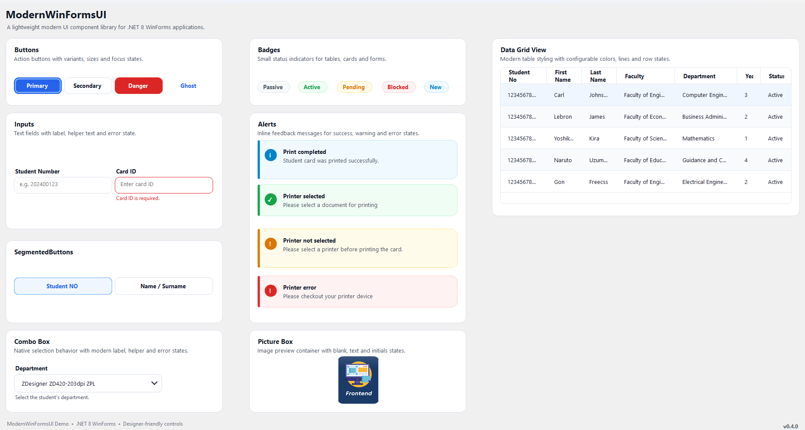

# ModernWinFormsUI

ModernWinFormsUI is a lightweight modern UI component library for building cleaner and more consistent .NET 8 WinForms applications.



## Features

- Modern WinForms controls
- Designer-friendly component usage
- Theme tokens for colors, fonts, spacing and radius
- Custom button, card, text box, badge and alert components
- Lightweight and dependency-free
- Built for .NET 8 Windows Forms
- Segmented button component for selection-based UI patterns
- Modern picture box component for image previews, avatars and blank states
- Modern combo box component with custom dropdown styling and image icon support
- Modern data grid view component with configurable table colors, grid lines and row states
- Image icon support for buttons and combo boxes


## Components

- `MwButton`
- `MwCard`
- `MwTextBox`
- `MwBadge`
- `MwAlert`
- `MwSegmentedButton`
- `MwPictureBox`
- `MwComboBox`
- `MwDataGridView`

## Quick Example

```csharp
using ModernWinFormsUI.Controls;

var button = new MwButton
{
    Text = "Save",
    Variant = MwButtonVariant.Primary,
    ButtonSize = MwButtonSize.Medium,
    Width = 120
};

var segmentedButton = new MwSegmentedButton
{
    Text = "TC / Öğrenci No",
    IconText = "●",
    Selected = true,
    Width = 180
};

var pictureBox = new MwPictureBox
{
    EmptyState = MwPictureBoxEmptyState.Initials,
    Initials = "AY",
    Shape = MwPictureBoxShape.Circle,
    Fit = MwPictureBoxFit.Cover,
    Width = 80,
    Height = 80
};

var comboBox = new MwComboBox
{
    PlaceholderText = "Select printer",
    IconSize = 20,
    IconGap = 10,
    Width = 360
};

comboBox.AddItems(new object[]
{
    "ZDesigner ZD420-203dpi ZPL",
    "Microsoft Print to PDF",
    "Canon LBP6030"
});

comboBox.SelectedIndex = 0;

var grid = new MwDataGridView
{
    HeaderBackColor = Color.White,
    RowBackColor = Color.White,
    AlternateRowBackColor = Color.FromArgb(248, 250, 252),
    GridLineColor = Color.FromArgb(226, 232, 240),
    EmptyBackColor = Color.White,
    ModernRowHeight = 50,
    ModernHeaderHeight = 44,
    Radius = 8,
    Dock = DockStyle.Fill
};

grid.Columns.Add("StudentNo", "Student No");
grid.Columns.Add("FirstName", "First Name");
grid.Columns.Add("LastName", "Last Name");
grid.Columns.Add("Status", "Status");

grid.Rows.Add("12345678910", "Ahmet", "Yilmaz", "Active");


Project Status

This project is currently in early development.

Current version:

v0.4.0
Roadmap
Add MwComboBox
Add MwStatusBar
Add MwDataGridViewStyler
Add dark theme support
Publish as a NuGet package
Improve documentation and examples
License

MIT License